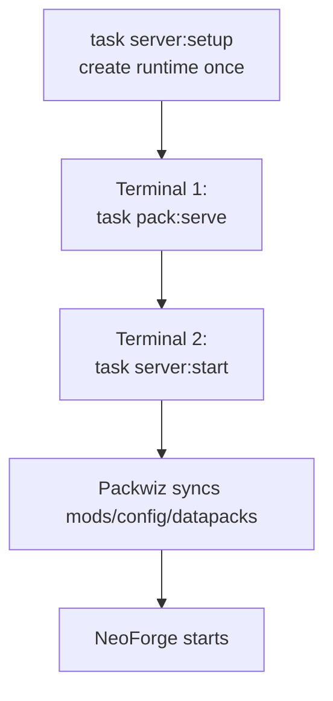
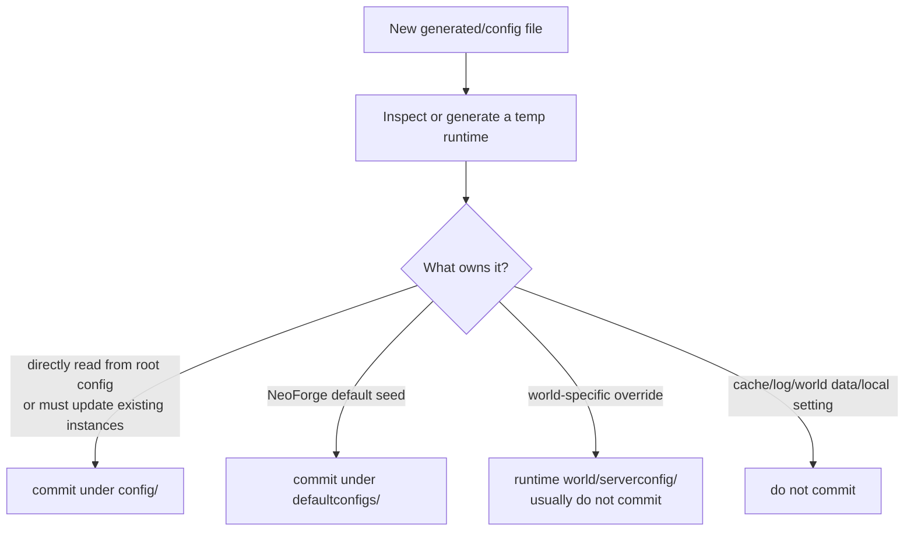

# MC Fantasy Packwiz

End-to-end Packwiz repo for the 1.21.1 Fantasy NeoForge pack.

This repo owns:

- the Packwiz pack definition
- client bootstrap/export defaults
- global datapacks
- shared default keybindings
- the small dedicated-server setup/update scripts

This repo does not own:

- the generated Minecraft server runtime
- worlds, logs, libraries, installers, crash reports, or backups
- each player's personal launcher settings

Main entry points:

- `Taskfile.yml` for day-to-day commands
- `scripts/pack.sh` for Packwiz/client/site/inspection work
- `scripts/server.sh` for dedicated-server runtime work
- [docs/client.md](docs/client.md) for player setup and client release details

## Paths

| Path                                         | Purpose                                                          |
| -------------------------------------------- | ---------------------------------------------------------------- |
| `/data/games/servers/minecraft/fantasy-lan/` | Generated dedicated-server runtime                               |
| `server-base/`                               | Tracked base templates copied during setup                       |
| `mods/`                                      | Packwiz mod metadata                                             |
| `config/`                                    | Packwiz-managed root config, client defaults, and Paxi datapacks |
| `defaultconfigs/`                            | NeoForge config defaults                                         |
| `dist/`                                      | Ignored build, inspection, export, and smoke-test output         |

## Prerequisites

- Java 21 JDK at `/usr/lib/jvm/java-21-openjdk/bin/java`
- `packwiz`
- Go Task, exposed as `task` or `go-task`
- `curl`
- `jq`
- `unzip`
- `tar` with zstd support for backups

Examples use `task`. If your binary is named `go-task`, replace `task` with `go-task`.

## Server Quick Start



Run these from the repo root.

1. Create the generated server runtime once:

   ```bash
   task server:setup
   ```

2. Keep Terminal 1 open to serve the local Packwiz pack:

   ```bash
   task pack:serve
   ```

3. Use Terminal 2 to sync and start NeoForge:

   ```bash
   task server:start
   ```

## Server Workflow

`task server:setup` does the one-time runtime setup:

- creates `/data/games/servers/minecraft/fantasy-lan/`
- installs NeoForge
- downloads Packwiz Installer Bootstrap
- accepts the EULA for this local runtime
- copies base templates from `server-base/`

Base templates copied during setup:

- `server-base/server.properties`
- `server-base/user_jvm_args.txt`

Setup copies those only when missing. To overwrite them during setup, run:

```bash
FORCE=true task server:setup
```

For normal updates:

```bash
task server:update
```

That syncs Packwiz-managed files into the existing runtime without starting the server. It needs `task pack:serve` running unless `PACK_URL` points at another reachable `pack.toml`.

`task server:start` runs the same sync first, then starts NeoForge.

## Runtime Ownership

| Files                                                                              | Owner                               | Normal update path                                     |
| ---------------------------------------------------------------------------------- | ----------------------------------- | ------------------------------------------------------ |
| `mods/`, `defaultconfigs/`, `config/paxi/datapacks/`, Packwiz-indexed `config/...` | Packwiz                             | `task server:update` or `task server:start`            |
| runtime `server.properties`, `user_jvm_args.txt`                                   | runtime, seeded from `server-base/` | `task server:diff-base`, then `task server:apply-base` |
| `world/`, `logs/`, `eula.txt`, libraries, generated configs                        | runtime                             | never committed, never overwritten by normal updates   |

Rules:

- `server-base/server.properties` is tracked on purpose.
- Generated `server.properties` files at repo root or inside the runtime are not tracked.
- Use `task server:diff-base` before applying base-template changes.
- Use `task server:apply-base` only when overwriting runtime base files is intentional.

`server:apply-base` creates timestamped backups under:

```txt
/data/games/servers/minecraft/fantasy-lan/base-template-backups/
```

## Config Placement



Use `config/` for files that should exist at the Minecraft instance root on clients, the dedicated server, or both. Packwiz installs these directly and updates them on:

- `task server:update`
- `task server:start`
- client updater launches
- `.mrpack` exports

Common `config/` examples:

- `config/paxi/datapacks/...`
- `config/defaultoptions/keybindings.txt`
- root config files proven to be read directly by a mod

Use `defaultconfigs/` for NeoForge config defaults. On this NeoForge 1.21.1 setup:

- NeoForge loads defaults from `defaultconfigs/`
- matching active files are generated under runtime `config/`
- `world/serverconfig/` is not the normal shared-default location

When in doubt:

- prefer `defaultconfigs/` for NeoForge `*-common.toml`, `*-server.toml`, and balance files if inspection proves they load from there
- prefer `config/` when the mod directly reads root `config/`
- prefer `config/` when Packwiz must update the active file in-place on existing instances
- never commit caches, logs, generated world data, or personal settings

## Datapacks

Put shared global datapacks under:

```txt
config/paxi/datapacks/<datapack-name>/
```

Paxi loads those datapacks for every world.

Because they are Packwiz-managed, they are included in:

- dedicated server syncs
- Prism/Freesm `.mrpack` exports
- local singleplayer worlds created from the exported pack

Do not put shared datapacks under `server-base/`; that folder is only for dedicated-server base templates.

## Adding or Inspecting Mods

Use Packwiz to add mods so metadata stays correct:

```bash
packwiz modrinth add <mod-slug>
task pack:refresh
```

Then inspect before committing config/control decisions:

```bash
task pack:inspect INSPECT=mod MOD=mods/<mod-file>.pw.toml
```

Inspection modes:

| Mode                     | Command                                                                          | Use for                                    |
| ------------------------ | -------------------------------------------------------------------------------- | ------------------------------------------ |
| Mod metadata or jar      | `task pack:inspect INSPECT=mod MOD=mods/example.pw.toml`                         | likely keybindings and config candidates   |
| Real launcher instance   | `task pack:inspect INSPECT=instance INSTANCE_MC_DIR=/path/to/instance/minecraft` | client-generated configs after one launch  |
| Materialized client pack | `task pack:inspect INSPECT=pack PACK_URL=http://127.0.0.1:8081/stable/pack.toml` | what Packwiz actually installs             |
| Generated server runtime | `task pack:inspect INSPECT=server-generated`                                     | server-generated configs and runtime paths |

Inspection reports are written to ignored `dist/inspect/`.

They are read-only reports. After reviewing them, update only intentional files under:

- `config/`
- `defaultconfigs/`
- `config/defaultoptions/keybindings.txt`

## Controls

Use Default Options for shared default keybindings.

Workflow:

1. Inspect the mod for keybinding IDs.
2. Open the maintainer client instance if names need confirmation.
3. Change controls in Minecraft.
4. Run:

   ```txt
   /defaultoptions saveKeys
   ```

5. Commit `config/defaultoptions/keybindings.txt`.

Do not commit a full `options.txt`. It would overwrite player preferences such as controls, video, audio, chat, and resource packs.

## Client Releases

Player-facing guide:

- [docs/client.md](docs/client.md)

Stable `.mrpack` import URL:

```txt
https://github.com/usersina/mc-fantasy-packwiz/releases/download/client-stable/mc-fantasy-stable.mrpack
```

Stable Packwiz updater URL:

```txt
https://usersina.github.io/mc-fantasy-packwiz/stable/pack.toml
```

Human-readable Pages root:

```txt
https://usersina.github.io/mc-fantasy-packwiz/
```

Build the hosted Packwiz site locally:

```bash
task pack:site
```

Smoke-test the client updater:

```bash
cd dist/site
python3 -m http.server 8081
```

Then in another terminal:

```bash
PACK_URL=http://127.0.0.1:8081/stable/pack.toml task pack:smoke-update
```

Export the public bootstrap `.mrpack`:

```bash
task pack:export-client
```

That writes:

```txt
dist/mc-fantasy-stable.mrpack
```

CI publishes the exported `.mrpack` to the `client-stable` GitHub Release after smoke tests pass.

## Release Checklist

Before pushing a pack change:

1. Refresh Packwiz:

   ```bash
   task pack:refresh
   ```

2. Build the site:

   ```bash
   task pack:site
   ```

3. Smoke-test the client updater against a local server.
4. Run generated-server inspection when config behavior changed:

   ```bash
   task pack:inspect INSPECT=server-generated
   ```

5. Update/restart the dedicated server during the same release window.

GitHub Actions on `main`:

- builds `dist/site/stable/`
- serves it locally in CI
- runs the client smoke update
- deploys GitHub Pages only after smoke passes
- updates the `client-stable` release artifact after smoke passes

## Useful Tasks

Task names use `domain:action`:

- `pack:*` for Packwiz/client/site/inspection work
- `server:*` for runtime work

| Task                      | Purpose                                                    |
| ------------------------- | ---------------------------------------------------------- |
| `task server:setup`       | create/install the runtime once                            |
| `task pack:serve`         | serve local `pack.toml` on port 8080                       |
| `task server:update`      | sync Packwiz-managed files without starting                |
| `task server:start`       | sync, then start NeoForge                                  |
| `task server:diff-base`   | compare runtime base files with `server-base/`             |
| `task server:apply-base`  | back up and overwrite runtime base files                   |
| `task server:backup`      | back up the active world and runtime config                |
| `task pack:refresh`       | refresh Packwiz index files                                |
| `task pack:site`          | build `dist/site/stable` for GitHub Pages                  |
| `task pack:smoke-update`  | verify client updater installs successfully                |
| `task pack:export-client` | export the Prism/Freesm `.mrpack` bootstrap                |
| `task pack:inspect`       | inspect mods, packs, instances, or generated server config |

## Overrides

Override Taskfile defaults for one run:

```bash
task server:start SERVER_DIR=/path/to/server JAVA21=/path/to/java21
```

Call the server script directly:

```bash
SERVER_DIR=/path/to/server JAVA21=/path/to/java21 ACCEPT_EULA=true ./scripts/server.sh setup
```

Call the pack script directly:

```bash
INSPECT=mod MOD=mods/beltborne-lanterns.pw.toml ./scripts/pack.sh inspect
```

## Troubleshooting

Java class version error:

- Symptom: `Unsupported class file major version 70`
- Cause: server launched with Java 26
- Fix:

  ```bash
  task server:start JAVA21=/path/to/java21
  ```

Runtime not created:

```bash
task server:setup
```

Pack URL not reachable:

- keep `task pack:serve` running in another terminal
- or set `PACK_URL` to a reachable hosted/local `pack.toml`

Rebuild the generated runtime from scratch:

```bash
rm -rf /data/games/servers/minecraft/fantasy-lan
task server:setup
```

Then run `task pack:serve` and `task server:start` again.

## Packwiz Notes

After editing pack files directly:

```bash
task pack:refresh
```

Add new mods through Packwiz:

```bash
packwiz modrinth add jei
packwiz curseforge add configured
```

## Mod Notes

Carry On uses the unofficial patched `carryon-neoforge-1.21.1-2.2.4.4-patched-no-slowness.jar` intentionally because the official 1.21.1 build hit server stability problems in this pack.

Player pickup remains enabled, but it has an intermittent `carryon:sync_carry_data` disconnect risk. Do not update or swap Carry On casually without retesting multiplayer player pickup.

## Todo

- [ ] Replace [mods/automaticsorter-1.3.1-1.21.1-neoforge.jar](mods/automaticsorter-1.3.1-1.21.1-neoforge.jar) with the [official 1.21.1 release](https://modrinth.com/mod/automaticsorter) once the [NeoForge release](https://github.com/EpicSniper/minecraft-automatic-sorter-mod/pull/18) is available.

<!-- Deleted due to potato P.Cs
- protomanlys-weather
- natural-regrowth-for-protomanlys-weather
- immersive-aerodynamics-for-protomanlys-weather -->
