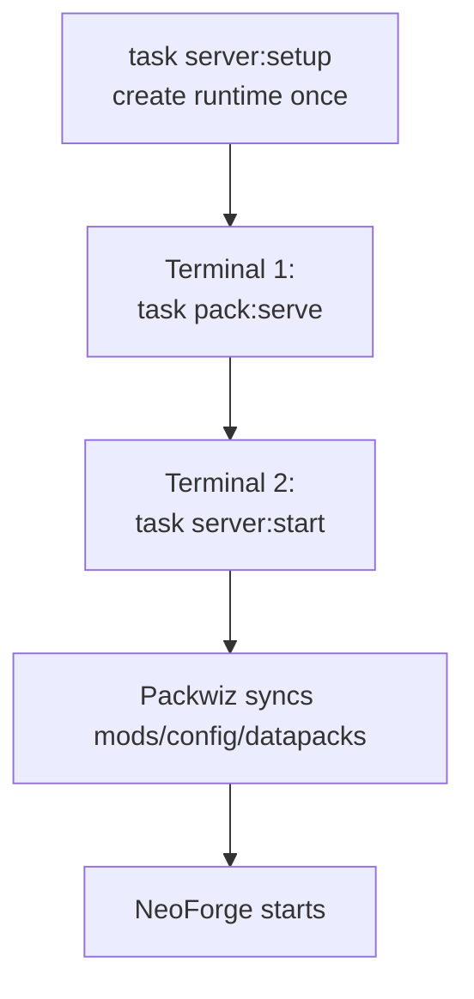
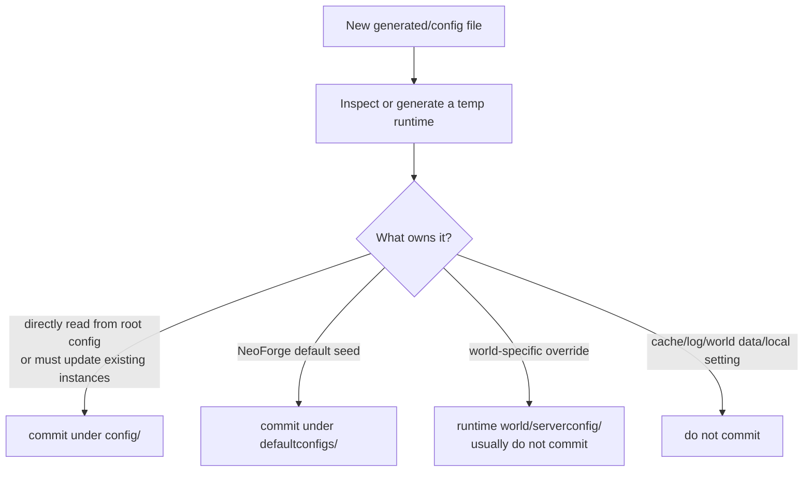
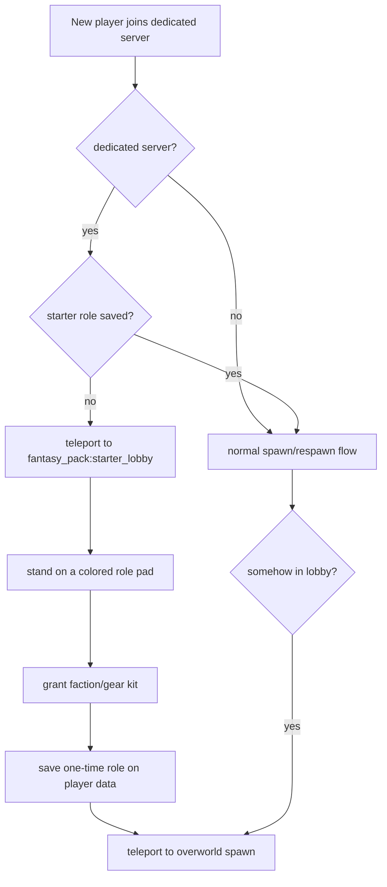
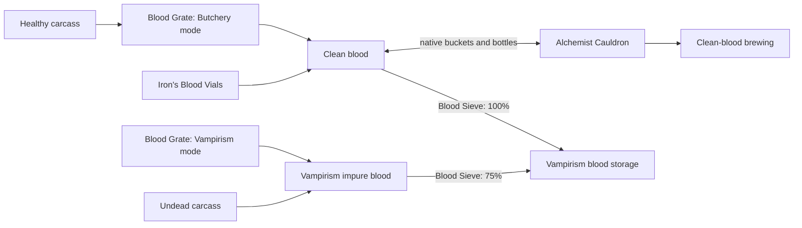
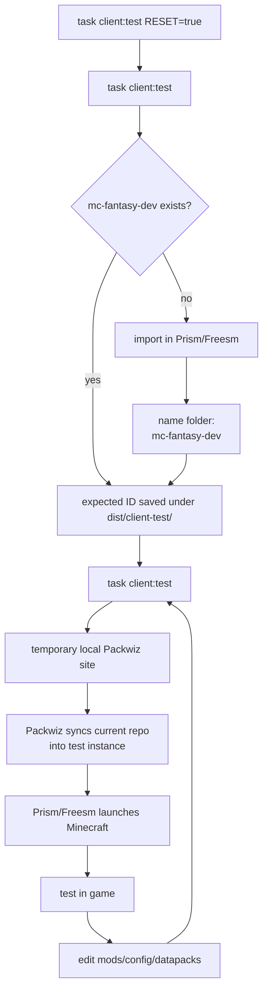

# MC Fantasy Packwiz

End-to-end Packwiz repo for the 1.21.1 Fantasy NeoForge pack.

This repo owns:

- the Packwiz pack definition
- client bootstrap/export defaults
- global datapacks
- shared default keybindings
- small KubeJS gameplay glue
- the small dedicated-server setup/update scripts

This repo does not own:

- the generated Minecraft server runtime
- worlds, logs, libraries, installers, crash reports, or backups
- each player's personal launcher settings

Main entry points:

- `Taskfile.yml` for day-to-day commands
- `scripts/pack.sh` for Packwiz/client/site/inspection work
- `scripts/server.sh` for dedicated-server runtime work
- [docs/client.md](docs/client.md) for player setup and client release details

## Paths

| Path                                         | Purpose                                                          |
| -------------------------------------------- | ---------------------------------------------------------------- |
| `/data/games/servers/minecraft/fantasy-lan/` | Generated dedicated-server runtime                               |
| `server-base/`                               | Tracked base templates copied during setup                       |
| `mods/`                                      | Packwiz mod metadata                                             |
| `config/`                                    | Packwiz-managed root config, client defaults, and Paxi datapacks |
| `defaultconfigs/`                            | NeoForge config defaults                                         |
| `kubejs/`                                    | Packwiz-managed KubeJS scripts                                   |
| `dist/`                                      | Ignored build, inspection, export, and smoke-test output         |

## Prerequisites

- Java 21 JDK at `/usr/lib/jvm/java-21-openjdk/bin/java`
- Java 17 JDK for `task pack:build-auth-tools`
- `packwiz`
- Go for `task pack:build-auth-tools`
- Go Task, exposed as `task` or `go-task`
- `curl`
- `jq`
- `unzip`
- `python3` for local client test serving
- `tar` with zstd support for backups
- `flock` from `util-linux` for server runtime locking
- Prism Launcher or Freesm Launcher for `client:test`

Examples use `task`. If your binary is named `go-task`, replace `task` with `go-task`.

## Server Quick Start



Run these from the repo root.

1. Create the generated server runtime once:

   ```bash
   task server:setup
   ```

2. Keep Terminal 1 open to serve the local Packwiz pack:

   ```bash
   task pack:serve
   ```

3. Use Terminal 2 to sync and start NeoForge:

   ```bash
   task server:start
   ```

4. From the server console, whitelist every allowed offline-mode username:

   ```txt
   whitelist add <username>
   ```

The pack intentionally retains `online-mode=false` for Basic Login, so the enforced whitelist is the outer access-control layer. Usernames are case-sensitive in offline mode.

## Server Workflow

`task server:setup` does the one-time runtime setup:

- creates `/data/games/servers/minecraft/fantasy-lan/`
- installs NeoForge
- downloads Packwiz Installer Bootstrap
- accepts the EULA for this local runtime
- copies base templates from `server-base/`

Base templates copied during setup:

- `server-base/server.properties`
- `server-base/user_jvm_args.txt`

Setup copies those only when missing. To overwrite them during setup, run:

```bash
FORCE=true task server:setup
```

For normal updates:

```bash
task server:update
```

That syncs Packwiz-managed files into the existing runtime without starting the server. It needs `task pack:serve` running unless `PACK_URL` points at another reachable `pack.toml`.

`task server:start` runs the same sync first, then starts NeoForge.

`server:start`, `server:update`, `server:apply-base`, and `server:backup` lock the runtime. Update, template application, and backup refuse to run while a Java server process is active in that runtime.

Back up only while the server is stopped:

```bash
task server:backup
```

The archive includes the world, active config, base runtime files, Basic Login passwords, operators, whitelist, bans, and username cache when those files exist.

## Chunk Pregeneration

Chunky is included as a server-side utility for pre-generating chunks.

It does not change gameplay and it does not generate chunks automatically. It only works while the server process is running and after an operator or the server console starts a pregeneration task.

The important rule: finalize your worldgen mods/configs first, then run Chunky. If you later add/remove worldgen mods, already-generated chunks will not magically regenerate; only new unexplored chunks use the new setup.

Recommended first run:

1. Back up the server:

   ```bash
   task server:backup
   ```

2. Start the server:

   ```bash
   task pack:serve
   task server:start
   ```

3. In the server console, pre-generate a modest overworld area around spawn:

   ```txt
   chunky world world
   chunky shape circle
   chunky spawn
   chunky radius 3000
   chunky start
   ```

Useful console commands:

- `chunky progress` shows current progress.
- `chunky pause` pauses the task and keeps progress.
- `chunky continue` resumes a paused task.
- `chunky cancel` stops and discards the current task.

Run big pregeneration jobs when nobody is playing, or when players know the server may lag. Chunky can run while people are online, but it competes for CPU, memory, and disk I/O with normal gameplay. Small radiuses are fine for testing; increase gradually after the server feels stable.

Repeat the same flow for other dimensions only if needed, for example `the_nether` or `the_end`.

## Runtime Ownership

| Files                                                                              | Owner                               | Normal update path                                     |
| ---------------------------------------------------------------------------------- | ----------------------------------- | ------------------------------------------------------ |
| `mods/`, `defaultconfigs/`, `config/paxi/datapacks/`, Packwiz-indexed `config/...` | Packwiz                             | `task server:update` or `task server:start`            |
| runtime `server.properties`, `user_jvm_args.txt`                                   | runtime, seeded from `server-base/` | `task server:diff-base`, then `task server:apply-base` |
| `world/`, identity JSON, logs, `eula.txt`, libraries, generated configs            | runtime                             | never committed, never overwritten by normal updates   |

Rules:

- `server-base/server.properties` is tracked on purpose.
- Generated `server.properties` files at repo root or inside the runtime are not tracked.
- Use `task server:diff-base` before applying base-template changes.
- Use `task server:apply-base` only when overwriting runtime base files is intentional.

`server:apply-base` creates timestamped backups under:

```txt
/data/games/servers/minecraft/fantasy-lan/base-template-backups/
```

## Config Placement



Use `config/` for files that should exist at the Minecraft instance root on clients, the dedicated server, or both. Packwiz installs these directly and updates them on:

- `task server:update`
- `task server:start`
- client updater launches
- `.mrpack` exports

Common `config/` examples:

- `config/paxi/datapacks/...`
- `config/defaultoptions/keybindings.txt`
- root config files proven to be read directly by a mod

Use `defaultconfigs/` for NeoForge config defaults. On this NeoForge 1.21.1 setup:

- NeoForge loads defaults from `defaultconfigs/`
- matching active files are generated under runtime `config/`
- `world/serverconfig/` is not the normal shared-default location

When in doubt:

- prefer `defaultconfigs/` for NeoForge `*-common.toml`, `*-server.toml`, and balance files if inspection proves they load from there
- prefer `config/` when the mod directly reads root `config/`
- prefer `config/` when Packwiz must update the active file in-place on existing instances
- never commit caches, logs, generated world data, or personal settings

## Datapacks

Put shared global datapacks under:

```txt
config/paxi/datapacks/<datapack-name>/
```

Paxi loads those datapacks for every world.

Because they are Packwiz-managed, they are included in:

- dedicated server syncs
- Prism/Freesm `.mrpack` exports
- local singleplayer worlds created from the exported pack

Do not put shared datapacks under `server-base/`; that folder is only for dedicated-server base templates.

## KubeJS Gameplay Glue

Keep KubeJS scripts small and pack-specific. Use them when a datapack cannot express the interaction cleanly.

Current custom behavior:

### Starter Role Lobby



The starter lobby is a separate Packwiz-managed Paxi datapack dimension:

```txt
config/paxi/datapacks/fantasy_starter_lobby/
```

The lobby is enabled only on dedicated servers. Local singleplayer worlds keep the datapack files installed, but KubeJS does not route players through the lobby there. If an older singleplayer test save already has a player inside `fantasy_pack:starter_lobby`, KubeJS sends them back to overworld spawn and then stays out of the way.

New dedicated-server players are sent there until they choose exactly one role. After a role is saved in player persistent data, the lobby is one-way: if that player somehow logs in or respawns there, KubeJS sends them back to overworld spawn.

Role selection validates every configured item first and requires all grant commands to succeed. A failed kit is logged and is not saved as chosen, so a renamed or missing mod item cannot permanently finalize a partial starter role.

Players choose by standing on the colored floor pad directly in front of a signed visual role block for about two seconds. The visual role blocks are only anchors; the pads are the trigger so the flow does not conflict with Carry On's sneak-right-click behavior. The lobby is protected by adventure mode and KubeJS block break/place cancellation.

Role choices:

| Role              | Visual block                    | Initial identity                                                                                         |
| ----------------- | ------------------------------- | -------------------------------------------------------------------------------------------------------- |
| Mage Apprentice   | `irons_spellbooks:arcane_anvil` | wizard armor, equipped starter spellbook, mage supplies                                                  |
| Vampire Fledgling | `vampirism:blood_pedestal`      | vampire level 4, worn vampire clothes, equipped blood spellbook, off-hand umbrella, filled blood bottles |
| Hunter Initiate   | `vampirism:hunter_table`        | hunter level 4, hunter gear, crossbow supplies                                                           |
| Werewolf Initiate | `werewolves:stone_altar`        | werewolf level 4, pelt gear, survival tools, werewolf supplies                                           |
| Explorer Pilot    | `minecraft:cartography_table`   | worn leather armor, ordered starter tools, airship, fuel, navigation                                     |
| Vanilla Start     | `minecraft:grass_block`         | no starter kit; spawn into the world normally                                                            |

Role kits are intentionally KubeJS-only. Do not add a token item or manual command flow unless the one-time lobby model changes.

### Faction Representatives

- Place a Vampirism Village Totem Base with a crafted Vampirism Village Totem Top directly above it.
- Sneak-right-click the base with `vampirism:vampire_blood_bottle` to summon a vampire representative.
- Sneak-right-click the base with any Vampirism hunter intel paper, such as `vampirism:hunter_intel_0`, to summon a hunter representative.
- The ritual only works on a Vampirism totem base with a crafted top directly above it, not ordinary blocks or fragile generated village totems.
- The representative appears beside the totem on the clicked side.

The same feature also overrides Vampirism task JSONs in the Paxi datapack so village-capture requirements become diamond payments:

```txt
1 village capture = 5 diamonds
```

### Blood Economy

The pack treats ordinary blood by quality rather than by mod namespace:

| System                | Purpose                                               | Pack rule                                                                                                                             |
| --------------------- | ----------------------------------------------------- | ------------------------------------------------------------------------------------------------------------------------------------- |
| Clean blood           | Butchery blood, Iron's blood, and Vampirism blood     | interchangeable at `1:1` in the Alchemist Cauldron; foreign clean blood passes through a Blood Sieve at `100%` into Vampirism storage |
| Impure blood          | Butchery infected blood and Vampirism impure blood    | cannot satisfy clean-blood brewing; both pass through a Blood Sieve at `75%`                                                          |
| Vampire Blood Bottles | infection, hunter progression, Bloodlines, and Ageing | never craftable from ordinary blood                                                                                                   |
| Pure Blood            | Vampirism leveling and high-tier addon progression    | remains Vampire Baron, structure-loot, and trade progression                                                                          |



For direct filtration, place the fluid handler above the sieve and a Vampirism Blood Container below it:

```text
Blood Grate, Blood Container, or Alchemist Cauldron
Blood Sieve
Vampirism Blood Container
```

The Alchemist Cauldron preserves the first clean blood fluid placed in it. Additional clean blood merges into that fluid at `1:1`, and the stored identity determines which native bottle or bucket can be extracted. Any clean blood can satisfy an Iron's Spells clean-blood brew such as Bloody Vellum.

Use the Blood Sieve when moving Butchery or Iron's blood into Vampirism-specific storage. The sieve outputs `vampirism:blood`, which can then be bottled, bucketed, drunk from a Blood Container, or used below a Blood Pedestal.

Balance rules:

- A Butchery heart plus a glass bottle yields one Iron's Blood Vial. It does not yield five vials.
- Butchery hearts and Vampirism human hearts convert `1:1` in either direction. Because Butchery hearts come from many carcasses, this deliberately makes human-heart recipes generous.
- Butchery bottles remain `333 mB` and Iron's Blood Vials remain `250 mB`. A container is accepted only when its entire volume fits, so partial insertion cannot delete blood.
- A full bucket of either impure fluid yields `750 mB` of finished Vampirism blood. A `333 mB` infected bottle yields `249 mB` and can leave `1 mB` because the sieve works in whole millibuckets.
- Vampirism blood buckets round-trip through the Alchemist Cauldron without changing fluid identity. Fill and empty Vampirism Blood Bottles with Vampirism's Blood Container.
- A wet Butchery Sponge discards up to `1000 mB` from a Blood Grate, Alchemist Cauldron, or Vampirism Blood Container per use. It never converts or purifies the stored fluid.
- A Blood Grate must be empty before its mode can change. This prevents impure blood from becoming clean through a mode toggle.
- Iron's Blood Cauldron remains a discrete vial-producing block, not a general fluid tank.
- Pure Blood 4 has the pack's heart-and-vial recipe; higher Pure Blood tiers retain their upstream progression.
- Vampire's Delight foods, Bloodlines abilities, and Vampiric Ageing retain their upstream recipes and rank tradeoffs.

After changing `kubejs/` scripts or Paxi datapack files, refresh Packwiz:

```bash
task pack:refresh
```

## Adding or Inspecting Mods

Use Packwiz to add mods so metadata stays correct:

```bash
packwiz modrinth add <mod-slug>
task pack:refresh
```

Check or apply available updates for Packwiz-managed mods:

```bash
task pack:check-updates
task pack:update -- sodium
task pack:update
```

Then inspect before committing config/control decisions:

```bash
task pack:inspect INSPECT=mod MOD=mods/<mod-file>.pw.toml
```

Inspection modes:

| Mode                     | Command                                                                          | Use for                                    |
| ------------------------ | -------------------------------------------------------------------------------- | ------------------------------------------ |
| Mod metadata or jar      | `task pack:inspect INSPECT=mod MOD=mods/example.pw.toml`                         | likely keybindings and config candidates   |
| Real launcher instance   | `task pack:inspect INSPECT=instance INSTANCE_MC_DIR=/path/to/instance/minecraft` | client-generated configs after one launch  |
| Materialized client pack | `task pack:inspect INSPECT=pack PACK_URL=http://127.0.0.1:8081/stable/pack.toml` | what Packwiz actually installs             |
| Generated server runtime | `task pack:inspect INSPECT=server-generated`                                     | server-generated configs and runtime paths |

Inspection reports are written to ignored `dist/inspect/`.

They are read-only reports. After reviewing them, update only intentional files under:

- `config/`
- `defaultconfigs/`
- `config/defaultoptions/keybindings.txt`

## Maintainer Client Test Loop

This is the Packwiz-pack equivalent of a mod repo's Gradle `runClient`.



First run:

1. Export and open the launcher import flow:

   ```bash
   task client:test
   ```

2. Finish the import in Prism/Freesm.
3. Use `mc-fantasy-dev` as the dev instance folder/name.

   The bootstrap run saves `mc-fantasy-dev` as the expected instance ID under `dist/client-test/`.

   If `mc-fantasy-dev` already exists, `task client:test` skips the import flow, remembers that instance, and uses Packwiz's incremental sync directly.

   If Freesm picks a different folder name, right-click the imported instance, open its instance folder, and use that exact folder name instead.

   ```bash
   task client:test CLIENT_INSTANCE_ID=<actual-instance-folder-name>
   ```

Normal test loop:

```bash
task client:test
```

What it does:

- refreshes Packwiz
- builds a temporary local site under `dist/client-test/site/`
- serves that site on `127.0.0.1:8082`
- syncs the current repo pack into the test instance Minecraft folder
- copies `packwiz-installer-bootstrap.jar` into that Minecraft folder
- disables the public stable Packwiz pre-launch updater for that test instance
- launches Prism/Freesm with `--launch <instance-id>`

If the task cannot find the instance folder automatically, pass it directly:

```bash
task client:test \
  CLIENT_INSTANCE_ID=<instance-folder-name> \
  INSTANCE_MC_DIR=/path/to/instance/.minecraft
```

To sync without launching:

```bash
task client:test LAUNCH=false
```

To switch or remember a different instance:

```bash
task client:test CLIENT_INSTANCE_ID=<new-instance-folder-name>
```

To forget the remembered instance and return to bootstrap mode:

```bash
task client:test RESET=true
```

Useful overrides:

- `CLIENT_LAUNCHER=prismlauncher`
- `CLIENT_LAUNCHER=org.prismlauncher.PrismLauncher`
- `CLIENT_LAUNCHER=org.freesmlauncher.FreesmLauncher`
- `CLIENT_LAUNCHER_ROOT=/custom/prism/root`
- `CLIENT_SERVER=host:port`
- `CLIENT_TEST_IMPORT_SLUG=mc-fantasy-dev`
- `CLIENT_TEST_PORT=8090`
- `CLIENT_TEST_DISABLE_PRELAUNCH=false`
- `LAUNCH=false`
- `RESET=true`

Notes:

- Prism's CLI launches by instance ID, which is the instance folder name.
- The remembered instance ID lives under ignored `dist/client-test/`.
- `RESET=true` forgets the saved ID; it does not delete any Prism/Freesm instance.
- If the test instance was imported from the public updater pack, `client:test` backs up `instance.cfg` and clears that public pre-launch updater by default. Otherwise the launcher would re-sync from published stable and undo local repo changes before Minecraft starts.
- `CLIENT_SERVER` is passed through as Prism/Freesm `--server`.
- A real launcher is still used for accounts, assets, natives, and Minecraft process setup.
- The generated local client folder under `dist/client-test/` is disposable.

## Controls

Use Default Options for shared default keybindings.

Workflow:

1. Inspect the mod for keybinding IDs.
2. Open the maintainer client instance if names need confirmation.
3. Change controls in Minecraft.
4. Run:

   ```txt
   /defaultoptions saveKeys
   ```

5. Commit `config/defaultoptions/keybindings.txt`.

Do not commit a full `options.txt`. It would overwrite player preferences such as controls, video, audio, chat, and resource packs.

## Client Releases

Player-facing guide:

- [docs/client.md](docs/client.md)

Stable `.mrpack` import URL:

```txt
https://github.com/usersina/mc-fantasy-packwiz/releases/download/client-stable/mc-fantasy-stable.mrpack
```

Stable Packwiz updater URL:

```txt
https://usersina.github.io/mc-fantasy-packwiz/stable/pack.toml
```

Human-readable Pages root:

```txt
https://usersina.github.io/mc-fantasy-packwiz/
```

Build the hosted Packwiz site locally:

```bash
task pack:site
```

Smoke-test the client updater:

```bash
cd dist/site
python3 -m http.server 8081
```

Then in another terminal:

```bash
PACK_URL=http://127.0.0.1:8081/stable/pack.toml task pack:smoke-update
```

Export the public bootstrap `.mrpack`:

```bash
task pack:export-client
```

That writes:

```txt
dist/mc-fantasy-stable.mrpack
```

CI publishes the exported `.mrpack` to the `client-stable` GitHub Release after smoke tests pass.
The export task opens the archive and verifies that every expected client/shared mod jar is present before CI can publish it.

## Release Checklist

Before pushing a pack change:

1. Refresh Packwiz:

   ```bash
   task pack:refresh
   ```

2. Build the site:

   ```bash
   task pack:site
   ```

3. Smoke-test the client updater against a local server.
4. Run generated-server inspection when config behavior changed:

   ```bash
   task pack:inspect INSPECT=server-generated
   ```

5. Update/restart the dedicated server during the same release window.

GitHub Actions on `main`:

- builds `dist/site/stable/`
- serves it locally in CI
- runs the client smoke update
- starts and cleanly stops a generated NeoForge server
- verifies custom task/loot overrides against the installed upstream jars
- rebuilds every source-backed local mod and rejects jar/source drift
- validates the exported `.mrpack` contents
- deploys GitHub Pages only after smoke passes
- updates the `client-stable` release artifact after smoke passes

### CurseForge API Authentication

[CurseForge CDN downloads](https://blog.curseforge.com/introducing-api-key-authentication-for-curseforge-file-downloads/)
require an API key. The repository keeps it in the GitHub Actions secret named
`CURSEFORGE_API_KEY` and sends it only in the recommended `X-API-Key` request
header.

The workflow builds pinned Packwiz CLI and Installer binaries with a small
CurseForge-header compatibility patch. Packwiz CLI reads the key from the CI
environment. The client Installer receives the integration key during its CI
build and is published as `packwiz-installer.jar` in the stable release so the
official bootstrapper can update clients without exposing the key in source,
Pages metadata, command lines, or the `.mrpack`.

Configure or rotate the secret with:

```bash
gh secret set CURSEFORGE_API_KEY
```

For a local authenticated smoke test, provide `CURSEFORGE_API_KEY` in the
environment and run:

```bash
task pack:build-auth-tools
PATH="$PWD/dist/tools:$PATH" \
  PACKWIZ_INSTALLER_MAIN_JAR="$PWD/dist/tools/packwiz-installer.jar" \
  task pack:smoke-update
```

Keep the key in the environment or a secret manager. Do not add it to the
Taskfile, Packwiz metadata, command arguments, or committed files.

## Useful Tasks

Task names use `domain:action`:

- `pack:*` for Packwiz/client/site/inspection work
- `client:*` for maintainer local client testing
- `server:*` for runtime work

| Task                      | Purpose                                                     |
| ------------------------- | ----------------------------------------------------------- |
| `task server:setup`       | create/install the runtime once                             |
| `task pack:serve`         | serve local `pack.toml` on port 8888                        |
| `task server:update`      | sync Packwiz-managed files without starting                 |
| `task server:start`       | sync, then start NeoForge                                   |
| `task server:diff-base`   | compare runtime base files with `server-base/`              |
| `task server:apply-base`  | back up and overwrite runtime base files                    |
| `task server:backup`      | back up the stopped world, config, and server identity data |
| `task pack:refresh`       | refresh Packwiz index files                                 |
| `task pack:check-updates` | check mod updates without changing the repo                 |
| `task pack:update`        | update one or every Packwiz-managed file, then refresh      |
| `task pack:build-auth-tools` | build pinned Packwiz tools with CurseForge key support   |
| `task pack:site`          | build `dist/site/stable` for GitHub Pages                   |
| `task pack:smoke-update`  | verify client updater installs successfully                 |
| `task pack:export-client` | export the Prism/Freesm `.mrpack` bootstrap                 |
| `task pack:inspect`       | inspect mods, packs, instances, or generated server config  |
| `task client:test`        | bootstrap, sync, or launch the maintainer test client       |

## Overrides

Override Taskfile defaults for one run:

```bash
task server:start SERVER_DIR=/path/to/server JAVA21=/path/to/java21
```

Call the server script directly:

```bash
SERVER_DIR=/path/to/server JAVA21=/path/to/java21 ACCEPT_EULA=true ./scripts/server.sh setup
```

Call the pack script directly:

```bash
INSPECT=mod MOD=mods/beltborne-lanterns.pw.toml ./scripts/pack.sh inspect
```

## Troubleshooting

Java class version error:

- Symptom: `Unsupported class file major version 70`
- Cause: server launched with Java 26
- Fix:

  ```bash
  task server:start JAVA21=/path/to/java21
  ```

Runtime not created:

```bash
task server:setup
```

Pack URL not reachable:

- keep `task pack:serve` running in another terminal
- or set `PACK_URL` to a reachable hosted/local `pack.toml`

Rebuild the generated runtime from scratch:

```bash
rm -rf /data/games/servers/minecraft/fantasy-lan
task server:setup
```

Then run `task pack:serve` and `task server:start` again.

## Packwiz Notes

After editing pack files directly:

```bash
task pack:refresh
```

Add new mods through Packwiz:

```bash
packwiz modrinth add jei
packwiz curseforge add configured
```

## Mod Notes

Carry On uses the unofficial patched `carryon-neoforge-1.21.1-2.2.4.4-patched-no-slowness.jar` intentionally because the official 1.21.1 build hit server stability problems in this pack.

Player pickup remains enabled through the pack-local Carry On Player Sync Fix. The patch strips unsafe payload data only for `PLAYER` carry packets and leaves block/mob serialization upstream-owned. Do not update or swap Carry On without retesting repeated multiplayer player pickup, release, and effect-bearing players.

Just Enough Resources is retained with the pack-local JER Compatibility Fix. The client-only patch makes JER use the active biome registry and excludes entity types whose base class is not a living entity, avoiding failures from modded biomes and Cataclysm Spellbooks beam entities. Broken Cataclysm Spellbooks recipes that reference unregistered items remain disabled with NeoForge data-load conditions; the working spell content remains enabled.

Better Tridents keeps its gameplay features, but `boost_impaling` is disabled. That option generates biome-based data which fails against this pack's modded biome registry and prevents a clean server data load.

The convenience datapack also repairs upstream entity-tag and spawn-category conflicts. `task pack:inspect INSPECT=server-generated` verifies those merged overrides against the installed jars, so mod updates fail validation instead of silently dropping another mod's entries.

Vampire Spells Addon 0.0.6 logs a false Iron's Spells API error because its startup diagnostic checks a removed legacy class. Its constructor does not gate addon registration on that check, so this is a known upstream logging defect rather than a missing dependency.

## Todo

- [ ] Replace [mods/automaticsorter-1.3.1-1.21.1-neoforge.jar](mods/automaticsorter-1.3.1-1.21.1-neoforge.jar) with the [official 1.21.1 release](https://modrinth.com/mod/automaticsorter) once the [NeoForge release](https://github.com/EpicSniper/minecraft-automatic-sorter-mod/pull/18) is available.
- [ ] Replace [mods/shield_surf-1.0.3-1.21.1-neoforge.jar](mods/shield_surf-1.0.3-1.21.1-neoforge.jar) once [this is merged](https://github.com/usersina/shield_surf).

<!-- Deleted due to potato P.Cs
- protomanlys-weather
- natural-regrowth-for-protomanlys-weather
- immersive-aerodynamics-for-protomanlys-weather -->
