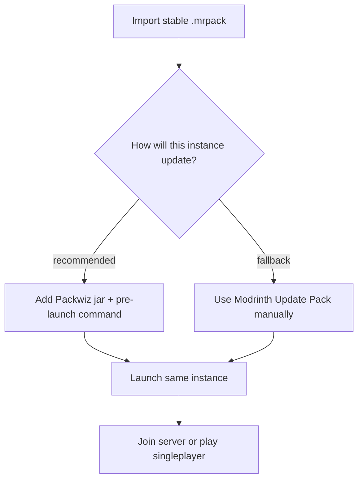
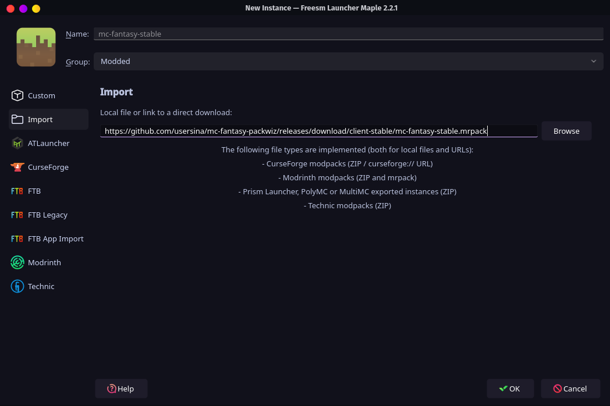
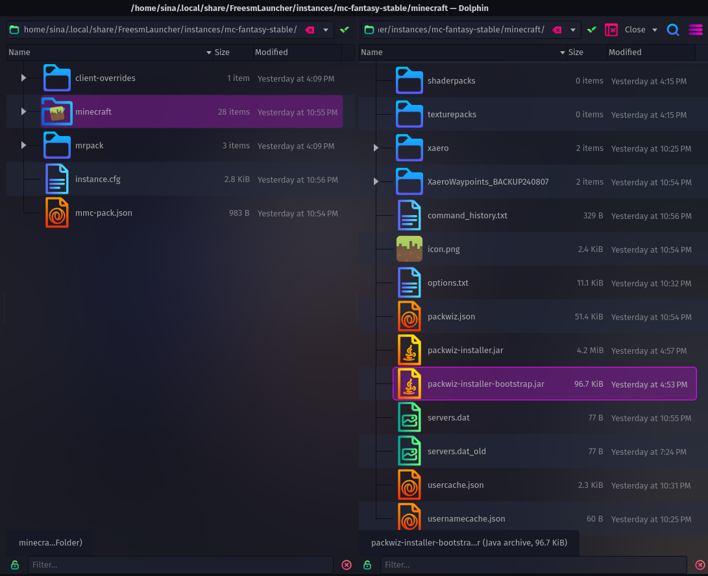
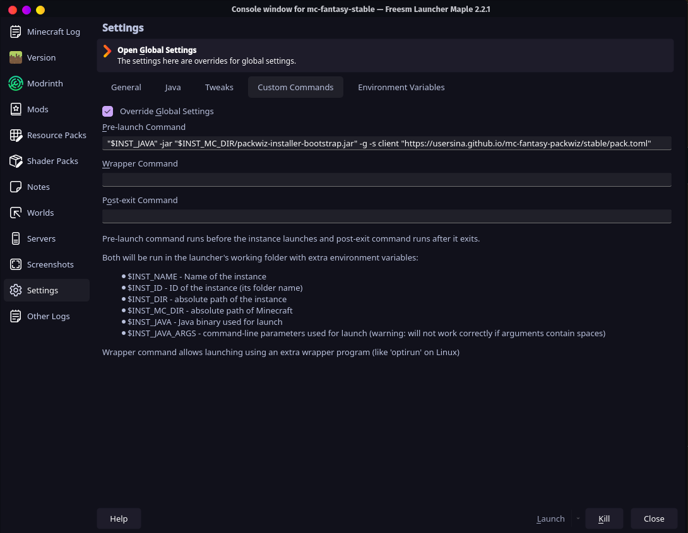
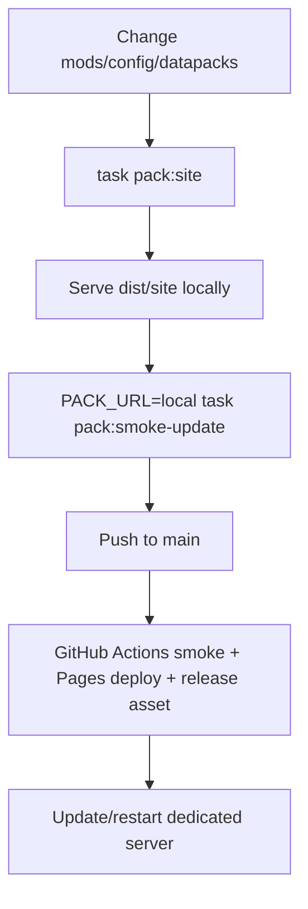

# Fantasy Pack Client Guide

Use this guide to join the Fantasy Minecraft server with Prism Launcher or Freesm Launcher.

## Pick an Update Method

Recommended method:

- import the `.mrpack` once
- add the Packwiz pre-launch updater to that same instance
- keep launching the same instance

Fallback method:

- import the `.mrpack`
- use the launcher's Modrinth **Update Pack** tab when the server owner publishes changes



## Initial Setup

Stable `.mrpack` import URL:

```txt
https://github.com/usersina/mc-fantasy-packwiz/releases/download/client-stable/mc-fantasy-stable.mrpack
```

Steps:

1. Install Prism Launcher or Freesm Launcher.
2. Make sure the launcher can use Java 21.
3. Choose:

   ```txt
   Add Instance
   Import
   ```

4. Paste the stable `.mrpack` URL.

   

5. Confirm the import.
6. Wait for the launcher to download the pack.
7. Continue with **Recommended Automatic Updates** before using the instance regularly.
8. Launch the imported instance.
9. Join the multiplayer server with the address you were given.

## Recommended Automatic Updates

Use this method so the same instance checks for pack updates before Minecraft starts.

Packwiz updater URL:

```txt
https://usersina.github.io/mc-fantasy-packwiz/stable/pack.toml
```

Steps:

1. Close Minecraft.
2. Right-click the imported instance.
3. Choose:

   ```txt
   Edit
   ```

4. Open the instance Minecraft folder.

   In Prism/Freesm this is usually:

   ```txt
   Folder
   Minecraft
   ```

   

5. Download Packwiz Installer Bootstrap:

   ```txt
   https://github.com/packwiz/packwiz-installer-bootstrap/releases/latest/download/packwiz-installer-bootstrap.jar
   ```

6. Put the jar directly in the instance Minecraft folder:

   ```txt
   <instance Minecraft folder>/packwiz-installer-bootstrap.jar
   ```

7. Open:

   ```txt
   Settings
   Custom commands
   ```

8. Add this pre-launch command:

   ```bash
   "$INST_JAVA" -jar "$INST_MC_DIR/packwiz-installer-bootstrap.jar" -g -s client "https://usersina.github.io/mc-fantasy-packwiz/stable/pack.toml"
   ```

   

9. Save the instance settings.
10. Launch the same instance.
11. Wait for Packwiz to finish, then Minecraft will start.

After this:

- keep using this same instance
- close Minecraft and relaunch to receive published updates
- do not manually add, remove, or update mods unless asked

## Fallback: Update Pack Tab

Use this if the automatic updater is not set up yet or the pre-launch command is broken.

When the server owner says the pack changed:

1. Close Minecraft.
2. Right-click the imported instance.
3. Choose:

   ```txt
   Edit
   ```

4. Open the Modrinth tab under the instance version settings.
5. Paste or confirm the stable `.mrpack` URL:

   ```txt
   https://github.com/usersina/mc-fantasy-packwiz/releases/download/client-stable/mc-fantasy-stable.mrpack
   ```

6. Press:

   ```txt
   Update Pack
   ```

7. Wait for the launcher to finish.
8. Launch the same instance.

This is a manual snapshot update. Restarting the instance does not check for new releases unless the automatic updater is configured.

## Last-Resort Reimport

Use this only if the launcher update tab is unavailable or broken:

1. Close Minecraft.
2. Choose:

   ```txt
   Add Instance
   Import
   ```

3. Paste the stable `.mrpack` URL again.
4. Import it as a new updated instance.
5. Launch the updated instance.

## Controls

The pack ships default key mappings through the Default Options mod.

What this means:

- new mods can have sane default keybinds
- your personal `options.txt` is not replaced on every launch
- you can still change controls locally
- the pack uses one shared default profile, not QWERTY/AZERTY variants

Change controls in:

```txt
Options
Controls
Key Binds
```

## Singleplayer

The pack is intended to work in local singleplayer too.

Singleplayer includes:

- the same client and shared mods
- gameplay/worldgen mods needed by integrated-server worlds
- global Paxi datapacks
- default keybindings

The starter role lobby is server-only. Local singleplayer worlds start normally and do not force the origin room.

## Troubleshooting

Minecraft does not start:

- set the instance to Java 21
- relaunch the same instance

`.mrpack` import fails:

- check that you are online
- retry the import
- send the launcher log if it still fails

Automatic updater does not run:

- check that `packwiz-installer-bootstrap.jar` is in the instance Minecraft folder
- check that the pre-launch command is exactly:

  ```bash
  "$INST_JAVA" -jar "$INST_MC_DIR/packwiz-installer-bootstrap.jar" -g -s client "https://usersina.github.io/mc-fantasy-packwiz/stable/pack.toml"
  ```

Freesm import refuses the pack:

- try importing with Prism Launcher

## Maintainer Notes

Everything below is for pack maintenance and release work.

## Maintainer: Updater Instance

The public `.mrpack` release is the player-facing bootstrap. It does not auto-update by itself.

A prepared updater instance is useful when you want to give friends a one-import instance that already has the Packwiz pre-launch command.

Build it like this:

1. Export the bootstrap:

   ```bash
   task pack:export-client
   ```

2. Import the `.mrpack` into Prism or Freesm.
3. Put `packwiz-installer-bootstrap.jar` in that instance's Minecraft folder.
4. Add the pre-launch command:

   ```bash
   "$INST_JAVA" -jar "$INST_MC_DIR/packwiz-installer-bootstrap.jar" -g -s client "https://usersina.github.io/mc-fantasy-packwiz/stable/pack.toml"
   ```

5. Export that configured launcher instance as a zip if desired.

Once configured, the instance pulls these from the hosted stable Packwiz site before Minecraft starts:

- new mods
- removed mods
- `defaultconfigs/`
- Packwiz-managed `config/`
- `config/defaultoptions/keybindings.txt`
- `config/paxi/datapacks/`

## Maintainer: Manual Export

Run from the repo root:

```bash
task pack:export-client
```

If your Go Task binary is named `go-task`:

```bash
go-task pack:export-client
```

The task:

- refreshes Packwiz
- derives Minecraft and pack versions from `pack.toml`
- creates `dist/`
- writes `dist/mc-fantasy-stable.mrpack`

The stable filename gives players a URL that does not change when the pack version changes.

Ignored release outputs:

- `dist/`
- `*.mrpack`

CI publishes the exported `.mrpack` to:

```txt
https://github.com/usersina/mc-fantasy-packwiz/releases/latest
```

Stable direct import URL:

```txt
https://github.com/usersina/mc-fantasy-packwiz/releases/download/client-stable/mc-fantasy-stable.mrpack
```

## Maintainer: Key Defaults

This pack does not ship a live `options.txt`.

Reason:

- Minecraft owns each player's local `options.txt`
- the updater must not overwrite personal controls, video, audio, chat, or resource-pack settings

Shared defaults live in:

```txt
config/defaultoptions/keybindings.txt
```

Default Options applies those defaults for keys that players have not customized yet.

When adding or changing controls:

1. Inspect the mod:

   ```bash
   task pack:inspect INSPECT=mod MOD=mods/example-mod.pw.toml
   ```

2. Open the maintainer client instance.
3. Change controls in Minecraft.
4. Run:

   ```txt
   /defaultoptions saveKeys
   ```

5. Commit `config/defaultoptions/keybindings.txt`.
6. Run:

   ```bash
   task pack:site
   task pack:smoke-update
   ```

Policy:

- keep one shared default profile
- do not create QWERTY/AZERTY variants
- let players adjust controls locally

## Maintainer: Inspection

Packwiz installs and exports the pack, but it does not fully explain a mod's default keybindings or generated configs. Use the repo inspector.

| Inspection                  | Command                                                                          |
| --------------------------- | -------------------------------------------------------------------------------- |
| Materialized Packwiz client | `task pack:inspect INSPECT=pack PACK_URL=http://127.0.0.1:8081/stable/pack.toml` |
| Existing launcher instance  | `task pack:inspect INSPECT=instance INSTANCE_MC_DIR=/path/to/instance/minecraft` |
| Generated dedicated server  | `task pack:inspect INSPECT=server-generated`                                     |
| One mod metadata file       | `task pack:inspect INSPECT=mod MOD=mods/example-mod.pw.toml`                     |

Reports are written to:

```txt
dist/inspect/
```

The inspector does not copy files into the pack. Review the report, then commit only intentional files.

Client-side generated config defaults require one of:

- static inspection
- scanning a real launcher instance after launch

The repo intentionally does not automate graphical Minecraft client startup.

## Maintainer: Release Checklist



Before publishing a client update:

1. Build the Packwiz site:

   ```bash
   task pack:site
   ```

2. Serve it locally:

   ```bash
   cd dist/site
   python3 -m http.server 8081
   ```

3. Smoke-test in another terminal:

   ```bash
   PACK_URL=http://127.0.0.1:8081/stable/pack.toml task pack:smoke-update
   ```

4. Push to `main` after local smoke passes.
5. Update/restart the dedicated server from the same pack version.

Smoke test checks:

- Packwiz installer exits successfully
- `mods/` exists
- `defaultconfigs/` exists
- `config/defaultoptions/keybindings.txt` exists
- `config/paxi/datapacks/` exists
- current metadata resolves for known non-trivial downloads

CI does the same high-level flow:

- rebuilds `dist/site/stable/`
- serves it locally
- runs the smoke update
- deploys GitHub Pages only after smoke passes
- updates the `client-stable` release asset only after smoke passes

## Maintainer: Pack Contents

Client export should include:

- client-side mods
- shared `both` mods
- gameplay/worldgen mods needed for local singleplayer
- `config/defaultoptions/keybindings.txt`
- `config/paxi/datapacks/`
- `defaultconfigs/`
- intentional resource packs or shaders

Client export should not include:

- generated server runtime
- `server-base/`
- server world saves
- logs
- crash reports
- libraries
- installers
- NeoForge runtime files
- repo docs
- Taskfile plumbing
- live launcher `options.txt`

`.packwizignore` keeps repo/server-only files out of the Packwiz index and `.mrpack` exports.

Expected `.mrpack` shape:

- `modrinth.index.json`
- `overrides/config/defaultoptions/keybindings.txt`
- `overrides/defaultconfigs/...`
- `overrides/config/paxi/datapacks/...`
- embedded jars only for current non-Modrinth export cases

Expected hosted Packwiz site shape:

- `pack.toml`
- `index.toml`
- files listed in `index.toml`

## Maintainer: Side Policy

The client export must work as a complete playable instance, including local singleplayer.

In Modrinth `.mrpack` metadata:

- `client` means client instance
- `server` means dedicated server
- integrated singleplayer still needs gameplay/worldgen mods in the client instance

Use `side = "both"` for mods needed by:

- world generation
- gameplay rules
- login/skin behavior
- integrated-server behavior
- local singleplayer

Use `side = "server"` only for mods that truly belong on the dedicated server and should not be present in an imported player instance.

The dedicated server still receives `both` mods because `task server:start` runs Packwiz Installer in server mode.

## Maintainer: Global Datapacks

Datapacks in `config/paxi/datapacks/` are managed by this repo and loaded globally by Paxi.

They apply to:

- dedicated server worlds
- local Prism/Freesm singleplayer worlds

## Maintainer: If Export Fails

Most mods are Modrinth-backed.

If export prints `added to zip` for a small number of non-Modrinth-compatible files:

- that can be OK
- those jars are embedded in the `.mrpack`

If export fails:

1. Check the failing mod metadata.
2. Import the pack locally in Prism.
3. Repair the download/import issue there.
4. Export a Prism instance zip as a manual recovery path.

## Maintainer: GitHub Pages

GitHub Pages should use GitHub Actions as its source.

The workflow publishes:

```txt
dist/site/stable/
```

to:

```txt
https://usersina.github.io/mc-fantasy-packwiz/stable/
```

The human-readable Pages root is built from `site/index.html`:

```txt
https://usersina.github.io/mc-fantasy-packwiz/
```

Version-change rule:

- normal mod/config/datapack/key-default updates flow through the hosted Packwiz updater
- Minecraft or NeoForge version changes require a new launcher instance zip

## References

- [Default Options](https://mods.twelveiterations.com/minecraft/default-options)
- [packwiz `modrinth export`](https://packwiz.infra.link/reference/commands/packwiz/modrinth/export/)
- [Paxi](https://modrinth.com/mod/paxi)
- [Prism Launcher import](https://prismlauncher.org/wiki/help-pages/zip-import/)
- [packwiz-installer distribution](https://packwiz.infra.link/tutorials/installing/packwiz-installer/)
- [Prism Launcher custom commands](https://prismlauncher.org/wiki/help-pages/custom-commands/)
